# Arquitectura MVC

Aplicación que trabaja con objetos coches, modifica la velocidad y la muestra

---
## Diagrama de clases:

---

## Diagrama de Secuencia

Ejemplo básico del procedimiento, sin utilizar los nombres de los métodos

El mismo diagrama con los nombres de los métodos

### Mi diagrama de secuencia

```mermaid
sequenceDiagram
    participant App
    participant View
    participant Controller
    participant Model

    App->>View: menu(opción 1)
    activate View

    View->>Controller: crearCoche()
    activate Controller

    Controller->>View: pedirModelo(String)
    activate View
    View-->>Controller: String (modelo)
    deactivate View

    Controller->>View: pedirMatricula(String)
    activate View
    View-->>Controller: String (matrícula)
    deactivate View

    Controller->>Model: crearCoche(String modelo, String matricula)
    activate Model
    Model-->>Controller: Coche
    deactivate Model

    Controller-->>View: String ("Coche creado")
    deactivate Controller
    deactivate View

    activate View
    View->>View: Vuelve al menú
    deactivate View
    
    View->>App:return
    App->>View: menu(opción 2)
    activate View

    View->>Controller: subirVelocidad()
    activate Controller

    Controller->>View: pedirMatricula(String)
    activate View
    View-->>Controller: String (matrícula)
    deactivate View

    Controller->>View: pedirVelocidad(String)
    activate View
    View-->>Controller: int (velocidad)
    deactivate View

    Controller->>Model: getVelocidad(String matricula)
    activate Model
    Model-->>Controller: int (velocidad actual)
    deactivate Model

    Controller->>Model: cambiarVelocidad(String matricula, int nuevaVelocidad)
    activate Model
    Model-->>Controller: int (velocidad modificada)
    deactivate Model

    Controller-->>View: String ("Velocidad cambiada")
    deactivate Controller
    deactivate View

    activate View
    View->>View: Vuelve al menú
    deactivate View

    View->>App:return
    App->>View: menu(opción 3)
    activate View


    View->>Controller: bajarVelocidad()
    activate Controller

    Controller->>View: pedirMatricula(String)
    activate View
    View-->>Controller: String (matrícula)
    deactivate View

    Controller->>View: pedirVelocidad(String)
    activate View
    View-->>Controller: int (velocidad)
    deactivate View

    Controller->>Model: getVelocidad(String matricula)
    activate Model
    Model-->>Controller: int (velocidad actual)
    deactivate Model

    Controller->>Model: cambiarVelocidad(String matricula, int nuevaVelocidad)
    activate Model
    Model-->>Controller: int (velocidad modificada)
    deactivate Model

    Controller-->>View: String ("Velocidad cambiada")
    deactivate Controller
    deactivate View

    activate View
    View->>View: Vuelve al menú
    deactivate View

    View->>App:return
    App->>View: menu(opción 4)
    activate View

    View->>Controller: mostrarCoches()
    activate Controller

    Controller->>Model: parking (lista de coches)
    activate Model
    Model-->>Controller: ArrayList<Coche>
    deactivate Model

    Controller-->>View: ArrayList<String> (datos de coches)
    deactivate Controller
    deactivate View

    activate View
    View->>View: Vuelve al menú
    deactivate View
    View->>App:return
    
    
```

### 🚨 Diagrama de secuencia con Observer

```mermaid
sequenceDiagram
    participant View
    participant Controller
    participant Model
    participant Coche
    participant Alarma

    View->>Controller: avanzar()
    Controller->>View: pedirMatricula()
    View-->>Controller: String (matrícula)
    Controller->>View: pedirCantidad()
    View-->>Controller: int (metros)

    Controller->>Model: avanzar(String, int)
    Model->>Coche: avanzar(metros)
    Coche->>Coche: calcular consumo y restar gasolina
    Coche-->>Coche: gasolina < 10L?
    alt Si gasolina baja de 10
        Coche->>Alarma: alertaGasolinaBaja(coche)
        Alarma-->>View: "⚠️ Alerta: Repostar"
    end
    Coche-->>Model: true/false
    Model-->>Controller: true/false
    Controller-->>View: mensaje avance o sin gasolina
```

